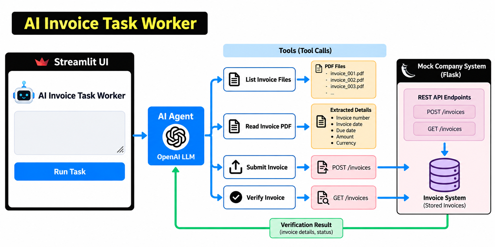

# 🤖 AI Invoice Task Worker

An autonomous AI worker that takes a natural-language invoice task, uses tools to inspect invoice PDFs, identifies the required invoice, submits it to a simulated company system, and verifies the result.

The project demonstrates **LLM tool calling, multi-step task execution, document processing, API interaction, and verification**.

---

## 🏗️ Architecture



---

## 🔄 How It Works

1. User enters a task through the **Streamlit UI**.
2. The **OpenAI-powered agent** understands the task and selects the required tools.
3. Invoice PDFs are discovered and their details are extracted.
4. The selected invoice is submitted through the **Flask REST API**.
5. The agent verifies that the invoice was successfully stored.
6. A concise result is returned to the user.

---

## 🛠️ Tech Stack

- **Python**
- **OpenAI Responses API & Tool Calling**
- **Streamlit**
- **Flask**
- **PyPDF**
- **Requests**
- **uv**

---

## 📁 Project Structure

```text
invoice_agent/
├── agent/
│   ├── agent.py
│   └── tools.py
├── data/
│   └── invoices/
├── images/
│   └── architecture.png
├── mock_app/
│   └── app.py
├── app.py
├── main.py
├── make_invoices.py
├── .env
├── pyproject.toml
└── README.md
```

---

## ⚙️ Setup

Install dependencies:

```bash
uv sync
```

Create a `.env` file:

```env
OPENAI_API_KEY=your_api_key
```

---

## ▶️ Run

Start the mock company system:

```bash
uv run mock_app/app.py
```

In another terminal, start Streamlit:

```bash
uv run streamlit run app.py
```

---

## 🔑 Key Features

- Natural-language task execution
- LLM-powered tool selection
- PDF invoice extraction
- Multi-step agent workflow
- REST API interaction
- Submission verification
- Basic retry handling
- Streamlit interface

---

## 🚧 Limitations

- Flask storage is currently in-memory.
- Invoice PDFs follow a predefined structure.
- The company system is simulated.
- Authentication and production-level monitoring are not implemented.

---

## 🔮 Future Improvements

- Sentence Transformers for semantic invoice search
- Human approval for sensitive actions
- Persistent database
- More robust document extraction
- Production enterprise integrations
- Improved logging and observability